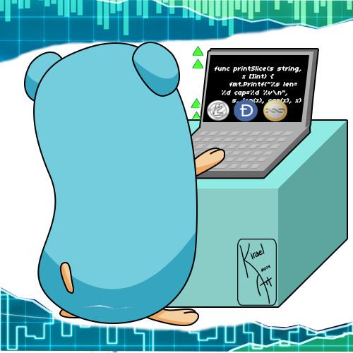

<p align="center"></p>
<p align="center">
  <a href="https://travis-ci.org/isvaldo/go-coinmarketcap-client"></img></a>
  <a href="https://ci.appveyor.com/project/golang/dep"></a>
  <a href="https://goreportcard.com/report/github.com/golang/dep"></a>
  <a href="https://codeclimate.com/github/golang/dep/coverage"></a>
</p>


# go-coinmarketcap-client

simple way to consult and explore the data of the coins

# import
--
    import "github.com/isvaldo/go-coinmarketcap-client"

# Simple example

```go
 
  package main
  
  import (
  	"fmt"
  	"github.com/isvaldo/go-coinmarketcap-client"
  )
        
  var Client coinmarket.Interface
  
  func init() {
  	var err error
  	Client, err = coinmarket.New("https://api.coinmarketcap.com")
  	if err != nil {
  		panic(err)
  	}
  }
  
  func main() {
  	// Get details from bitcoin
  	coinTicker, _ := Client.GetTicker("bitcoin")
  	fmt.Println("----GetTicker----")
  	fmt.Println(coinTicker.Name,
  		coinTicker.Symbol,
  		coinTicker.PriceBtc,
  		coinTicker.PercentChange1H,
  		coinTicker.PercentChange24H,
  		coinTicker.PercentChange7D)
  	// return last coins ranked
  
  	lastCoinTicker, _ := Client.GetTickerLast()
  	fmt.Println("--getTickerLast--")
  	for index := range lastCoinTicker.TickerList {
  		fmt.Println(index, lastCoinTicker.TickerList[index].Name,
  			lastCoinTicker.TickerList[index].PercentChange1H)
  	}
  
  	//Return last 3 coins ranked
  	limitCoinsTicker, _ := Client.GetTickerWithLimits(3)
  	fmt.Println("--getTickerWithLimits--")
  	for index := range limitCoinsTicker.TickerList {
  		fmt.Println(index, limitCoinsTicker.TickerList[index].Name,
  			limitCoinsTicker.TickerList[index].PercentChange1H)
  	}
  
  	//Return a range coins ranked (start, end) position
  	Client.GetTickerInRange(10, 15)
  
  	//Helpers
  
  	response, _ := Client.GetTickerLast()
  
  	response.First() // return first item
  	response.Last()  // return last item
  	response.Size()  //return size
  
  	response.GetCoinNameStartsWith("bit") // return list of coins name starts with 'bit'
  	response.GetCoinSymbolStartsWith("b") // return list of coins symbol starts with 'b'
  
  	response.SortByPercentChange1H()  //sort by PercentChange1H
  	response.SortByPercentChange7D()  //sort by PercentChange7D
  	response.SortByPercentChange24H() //sort by PercentChange24H
  
  	response.SortByPriceBtc()        // sort by price btc
  	response.SortByAvailableSupply() // sort available supply
  	response.SortByMarketCapUsd()    // sort by market cap usd
  }


```

